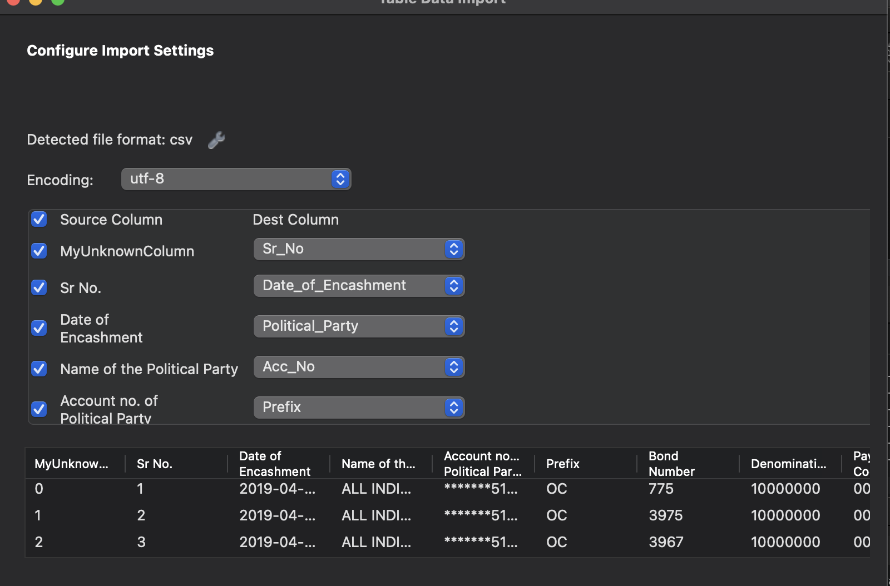

# DCC-Website

## Submission Details
- *Name:* Afraz
- *Roll No:* 23110019
- *Course Code:* ES113

## Conversion
- The conversion process involved utilizing the FITZ Module, which is likely a module or library used for handling PDF documents. This suggests that the project may have involved converting PDF files into a different format or extracting information from PDFs.

The image linked here likely shows the result of the conversion process.

## Upload to MySQL
Data was uploaded to MySQL using the Table Data Import Wizard. This indicates that data from a source, possibly the converted files or another dataset, was transferred into a MySQL database. The following steps were taken:

1. *Step 1: Select File*
This step involves selecting the file that contains the data to be imported into MySQL. Users are typically prompted to browse their file system to locate and select the desired file.

   
   

2. *Step 2: Select Schema*
This step involves selecting the table that has to be written to in MySQL. Users are can either create a new table based on their current Schema or use an existing table.
   

3. *Step 3: Select Column Match*
If using an existing table users have to match the current data column headers with the headers in the file specified.
   

4. *Step 4: Import*
   Once the file and column mappings are finalized, users proceed with the import process. This step initiates the transfer of data from the selected file into the MySQL database according to the specified configurations.
   

## Flask App
- Unfortunately, the Flask application could not be completed due to an issue specific to the Apple Operating System. This statement implies that the development environment or tools required for creating the Flask application encountered compatibility issues with macOS or other Apple OS versions.

1. Filter Page
   
   This file is the filter page made from using Bootstrap 5.3

   
   
   This is the issue that is getting arised. The app just will not run the query and will exit the code without throwing any errors.
   
